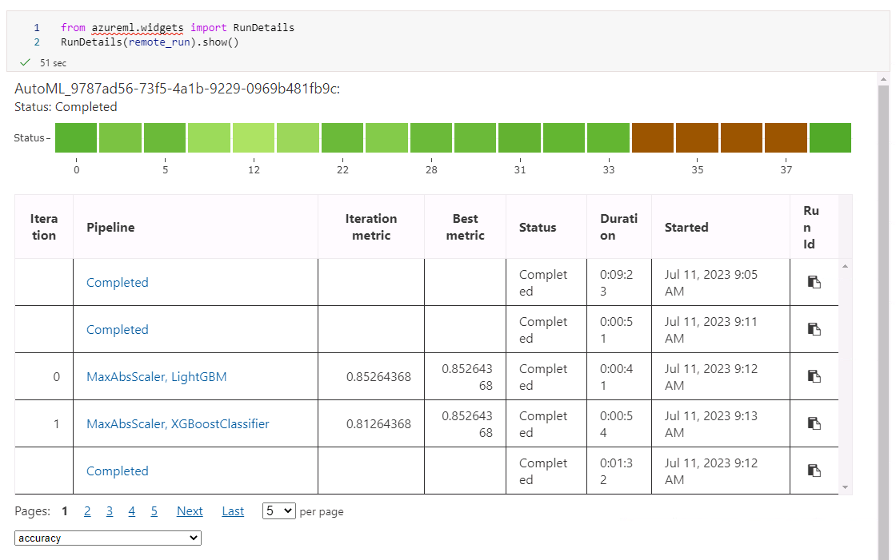
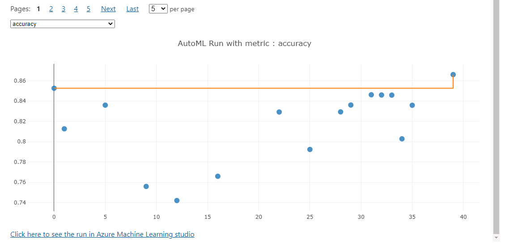
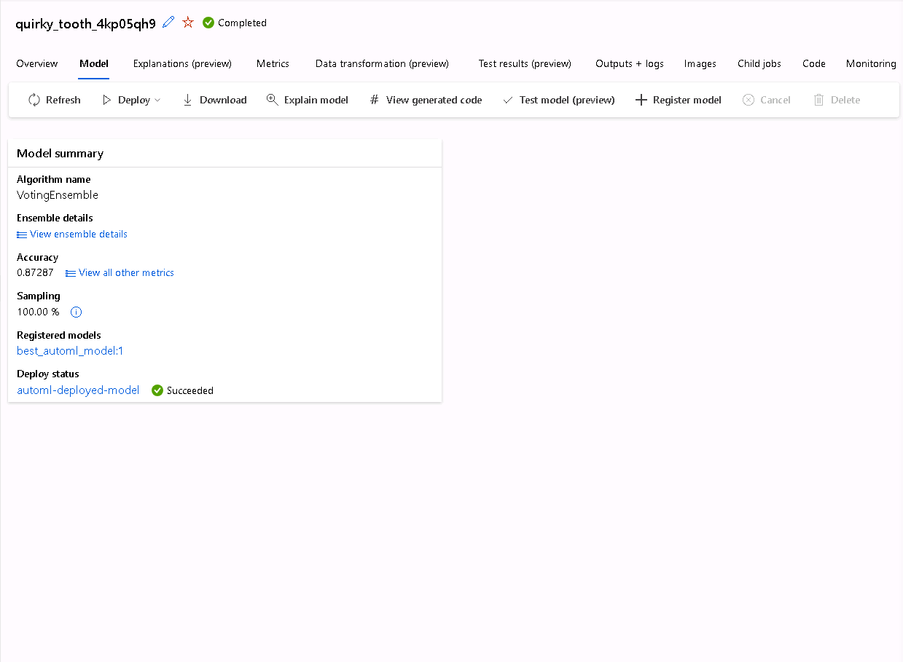
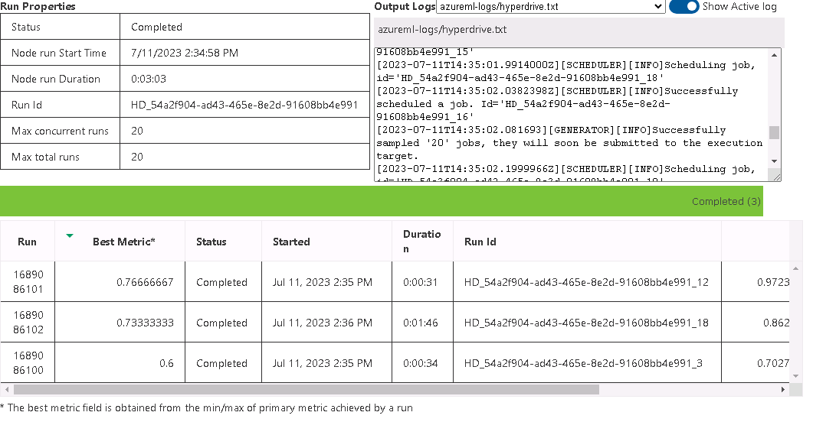
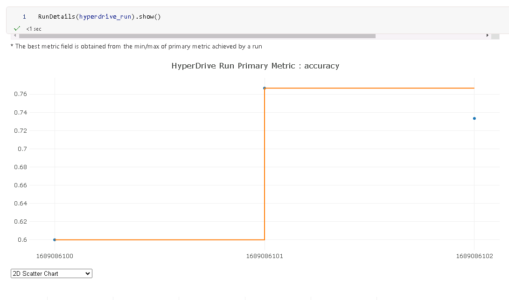
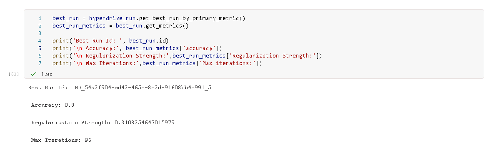
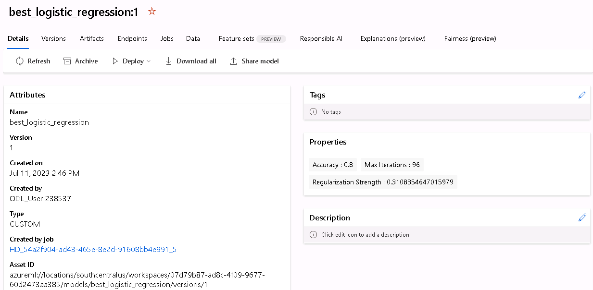
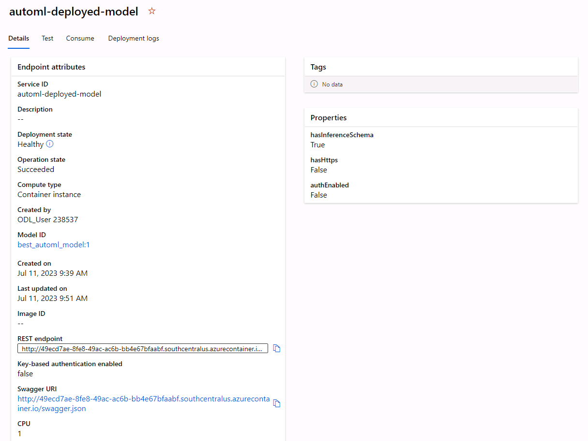

# Prediction of Heart Failure with Azure

In this final project of the Azure Machine Learning Nanodegree we predict heart failures with use of the Azure Machine Learning Studio.
Thereby, we compare an AutoML model with a logistic regression (whose hyperparamters will additionally be tuned).


## Dataset

### Overview

This data set dates from 1988 and consists of four databases: Cleveland, Hungary, Switzerland, and Long Beach V. It contains 76 attributes, including the predicted attribute, but all published experiments refer to using a subset of 14 of them.
The "DEATH EVENT" field refers to the presence of heart disease in the patient. It is integer valued 0 = no disease and 1 = disease.
The dataset was downloaded from [Kaggle](https://www.kaggle.com/datasets/fedesoriano/heart-failure-prediction).

### Task

The task in this project it to predict, we whether a patient will suffer a hearth failure or not. 
We will use the 13 features of the dataset to predict the output variable "DEATH_EVENT". 

### Access

The dataset can be found in the [project's root](https://github.com/jopagel/Azure-Heart-Failure-Prediction). During the trainings (automl & hyperparamter tuning of the logistic regression)
we upload the dataset to a datastore and subseqently register it as a dataset in the Machine Learning Studio.

## Automated ML
The first modeling approach we conducted was the AutoML. Thereby we set the timeout to 20 min. This is used as an exit criteria and defines how long (in minutes) your experiment should continue to run. The maximum of concurrent iterations is 5 because we only have a 4 nodes cluster of STANDARD_D2_V2 to run the experiment.
In addition we set accuracy as the primary metric to select the best resulting model since this is the main metric to evaluate classification models.

*Note: The next two screenshots show the training processing in the Notebook widget.*





### Results

The best resulting run was a VotingEnsemble, which reached a accuracy of 87.29%. The correpsonding parameters of the model can be found in the [Jupyter Notebook](https://github.com/jopagel/Azure-Heart-Failure-Prediction/blob/main/hyperparameter_tuning.ipynb)



We could improve the modeling process further, if we conduct other preprocessing methods before, like feature scaling and feature selection.


## Hyperparameter Tuning

Before we train and tune the logistic regression, we split the dataset into 90% for training and 10% for testing.
We utilize sklearn's LogisticRegression Class to establish and fit the model.
Thereby, we define a parameter sampler to tune the hyperparameters, specifically the inverse regularization parameter (C) and maximum number of iterations (max_iter).
Additionally, random parameter sampling was used, because it is an efficient, exploratory, and parallelizable method for hyperparameter tuning, which can potentially find better hyperparameters than other search methods. It is also robust to noise and other sources of variability in the training process. Additionally, a bandit policy was applied, since it is a popular early termination policy used in hyperparameter tuning that aims to save computational resources by terminating poorly performing runs early.

With the estimator, parameter sampler, and an early termination policy, we create a HyperDrive Config, which is subsequently submitted as an experiment.
Upon completion of the run, we determine that the best model archives a validation accuracy of 80%.

*Note: The next two screenshots show the training processing in the Notebook widget.*






### Results

With the described hyperparamter tuning approach of the logistic regression model we reached a validation accuracy of 80.00%. 
Thereby, a regularization strength of 31.09% and a max iteration of 96 was sampled. 
We could improve the tuning further, if we include more hyperparamters with a broader range. 






## Model Deployment

Since the Voting Ensemble (resulting from the automl approach) performed better (accuracy = 87.30%) than the hyperparamter tuning of the logistic regresion (accuracy = 80.00),
we deployed the Voting Ensemble.




We can now send a reqest to the deployed model with sample data:

```python
import urllib.request
import json
import os
import ssl

def allowSelfSignedHttps(allowed):
    # bypass the server certificate verification on client side
    if allowed and not os.environ.get('PYTHONHTTPSVERIFY', '') and getattr(ssl, '_create_unverified_context', None):
        ssl._create_default_https_context = ssl._create_unverified_context

allowSelfSignedHttps(True) # this line is needed if you use self-signed certificate in your scoring service.

# Request data goes here
# The example below assumes JSON formatting which may be updated
# depending on the format your endpoint expects.
# More information can be found here:
# https://docs.microsoft.com/azure/machine-learning/how-to-deploy-advanced-entry-script
data =  {
  "data": [
    {
      "age": 0.0,
      "anaemia": 0,
      "creatinine_phosphokinase": 0,
      "diabetes": 0,
      "ejection_fraction": 0,
      "high_blood_pressure": 0,
      "platelets": 0.0,
      "serum_creatinine": 0.0,
      "serum_sodium": 0,
      "sex": 0,
      "smoking": 0,
      "time": 0
    }
  ]
}

body = str.encode(json.dumps(data))

url = deployed_service.scoring_uri


headers = {'Content-Type':'application/json'}

req = urllib.request.Request(url, body, headers)

try:
    response = urllib.request.urlopen(req)

    result = response.read()
    print(result)
except urllib.error.HTTPError as error:
    print("The request failed with status code: " + str(error.code))

    # Print the headers - they include the requert ID and the timestamp, which are useful for debugging the failure
    print(error.info())
    print(error.read().decode("utf8", 'ignore'))
```


## Screen Recording

*TODO* Provide a link to a screen recording of the project in action. Remember that the screencast should demonstrate:
- A working model
- Demo of the deployed  model
- Demo of a sample request sent to the endpoint and its response

